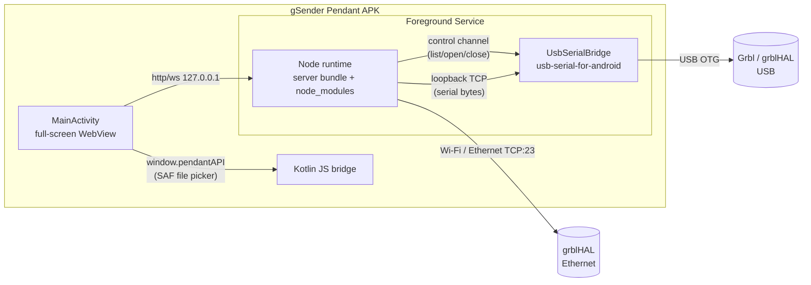

# Android Pendant: Investigation Report

**Status:** Investigation only. No implementation yet.
**Scope:** Android build of the **pendant app** (`src/pendant`) only, not the main gSender UI.
**Target devices:** arm64 tablets with USB host support, running Android 10 or later.
**Constraints:** Must be fast. Must be easy to keep in step with desktop gSender. Wrapper and native code are written in Kotlin.
**Decision already made:** The existing Node server (`src/server`) runs **on the device** instead of being rewritten in Kotlin.

---

## 1. Summary

| Area | Recommendation | Effort | Risk |
|---|---|---|---|
| Server hosting | Run the unchanged esbuild server bundle in an embedded Node runtime, managed by a Kotlin foreground service | Medium | **Node runtime choice** (see section 4.1) |
| UI | An Android WebView loads `http://127.0.0.1:<port>/pendant/`, which the local server serves | Low | Low |
| Ethernet | Works as-is (`net.Socket` in `SerialConnection`) | None | Low |
| USB serial | Kotlin (`usb-serial-for-android`) bridges the USB device to a **loopback TCP socket**. The server gets a small new "bridge" transport branch. | Medium | Low–Medium |
| Visualizer parser | **Don't go native first.** Restore the pendant's cheap `svgOnly` worker path, then measure on a real tablet. If native is still needed, use Kotlin Multiplatform so there is only one parser. | Low, then possibly High | Medium (keeping output identical to the JS parser) |
| Firmware flashing | Leave out of v1 | – | – |
| **Phase 2** (section 8) | Move the safety-critical and timing-critical pieces to Kotlin: a watchdog, the realtime command path, file I/O and flashing. Pass the Google Play compliance checks. | Medium–High | Low–Medium |

The pattern is the same everywhere: **Kotlin handles only what the platform requires** (USB, lifecycle, file picking, permissions). All CNC logic stays in the shared JS/TS code, so every protocol fix in gSender reaches Android automatically.

---

## 2. What exists today

### 2.1 Pendant UI
- `src/pendant/` is a Vite + React 18 + Tailwind SPA of about 11k lines. The entry point is `src/pendant/src/entry-pendant.tsx`.
- It depends heavily on the main app. About 32 files import from `src/app/src` through Vite aliases, including:
  - the Redux store and slices
  - the Socket.IO client `app/lib/controller`
  - the axios API client `app/api`
  - ATC, probing, jogging and plugin code
  - `workers/Visualize.worker.ts`
- It talks to the server with **relative URLs**: `/socket.io`, the `/api/macros*` routes (via `app/api`), and `fetch('/api/file')` in `src/pendant/src/utils/gcodeProcessing.ts` (around line 363).
- `src/pendant/src/electron-bridge.ts` quietly does nothing when not running in Electron. The only feature lost in a plain browser is the native file picker (`pendant:pick-gcode-file`).
- The store falls back to `localStorage['sienci']` when Electron's `fs` is unavailable (`src/app/src/store/index.ts`). This works in a WebView.

### 2.2 Standalone pendant (Electron) is already the right shape
`src/pendant-main.js` calls `launchServer()` from `src/server-cli.js` **in the same process** and then opens a kiosk window at `http://<addr>:<port>/pendant`. The Android app keeps this layout and swaps the platform pieces:

| Electron pendant | Android pendant |
|---|---|
| Electron main process | Kotlin `Application` + foreground `Service` |
| Node server in the main process | Node runtime inside the app (see section 4) |
| BrowserWindow in kiosk mode | Full-screen `WebView` activity |
| `preload-pendant.js` → `window.pendantAPI` | `WebView.addJavascriptInterface` / `WebMessagePort` → the same `window.pendantAPI` shape |
| `serialport` native module | Kotlin USB serial bridge (see section 3.2) |

### 2.3 Server
- About 25.6k lines in `src/server`:
  - Express 4.16 (`app.js`, about 60 `/api` routes)
  - Socket.IO in `services/cncengine/CNCEngine.js`
  - About 12k lines of protocol logic in `controllers/Grbl*`, `lib/Sender.js`, `lib/Feeder.js`, `lib/JogStreamer.js`, `lib/ToolChanger.js` and related files
- Built by `esbuild.config.js` with `platform: 'node'`, `target: 'node18'` and `packages: 'external'`. `node_modules` is shipped next to the bundle.
- Code that assumes Electron or desktop:
  - `services/cncengine/CNCEngine.js:24`: a top-level `import { app } from "electron"`, used at line 349 to read `preferences.json`. It is already guarded by `&& app`, so it only needs a stub module.
  - `api/api.log.js`: `electron-log`.
  - `lib/logger.js:45` and `config/settings.base.js:70`: already wrap `require('electron')` in try/catch.
  - Native modules: `serialport` (plus `@serialport/bindings-cpp`), `usb` (DFU), `@sienci/avrgirl-arduino`.
  - `child_process`: `lib/Firmware/Flashing/UF2Flasher.js`, `services/taskrunner`.
  - The server imports UI constants from `../../app/src/constants`. This is harmless because esbuild inlines them.
- Storage: rc files in the home directory (`.sender_rc`), `~/.sienci-sessions`, and `getUserDataPath()`, which uses `GSENDER_USER_DATA` if set.
- Auth is effectively off. `express-jwt` errors are bypassed in `app.js`, and `access-control.js` has `let pass = true`.
- Prior work: `sidecar-main.js`, from the earlier Tauri experiment, already runs the server under plain Node and stubs `serialport` when the binding fails to load.

---

## 3. Communication

### 3.1 The transport layer
One class handles both transports: `src/server/lib/SerialConnection.js`.

```
SerialConnection (serial | TCP)
  → Connection (lib/Connection.js: $I firmware detection, 7 tries at 800 ms)
  → GrblController / GrblHalController
  → CNCEngine (Socket.IO)
```

**What the rest of the server relies on (must be kept):**
- **Events:**
  - `data(line)`: split on `\n`, with `\r` kept
  - `open`
  - `close(err?)`
  - `error(err)`
- **Methods:**
  - `open(cb)`
  - `close(cb)`
  - `isOpen`
  - `write(data, ctx)`: goes through `writeFilter`, then `Buffer.from(data)`
  - `writeImmediate(data)`
  - `setWriteFilter(fn)`
  - `addPortListeners()`
- **Raw stream access:** `Connection.getConnectionObject().port`. `lib/YModemUSB.js` uses it to `unpipe` the line parser and swap in `ByteLengthParser({length: 1})` for YModem ACK/NAK handshakes, then restore the line parser.

**Timing the transport must not delay:**
- 250 ms status polling (`?`, or `0x87` when in alarm), gated on the previous reply arriving
- Character-counting streaming in `lib/Sender.js`: receive-buffer budget of 100 for Grbl and 724 for grblHAL, raised using `Bf:` from the status report
- `lib/JogStreamer.js` 10 ms tick, keeping up to 6–8 lines in flight
- Feed and spindle overrides queued 25 ms apart

At 115200 baud a byte takes about 87 µs on the wire. A loopback TCP hop on the device adds tens of microseconds, which is well under any of these budgets.

### 3.2 USB serial (recommended: Kotlin → loopback TCP bridge)
No Android binding exists for `serialport`. Rather than faking the `serialport` API inside Node, **Kotlin owns the USB device and exposes its byte stream on `127.0.0.1:<ephemeral port>`.** The server reads and writes it with a plain `net.Socket`, which `SerialConnection` already does for Ethernet.

**Kotlin side (`UsbSerialBridgeService`)**
- `usb-serial-for-android` (mik3y) opens the device. It supports FTDI, CH34x, CP210x, PL2303 and CDC-ACM, which covers everything in gSender's allowlist.
- Line settings: 115200 8N1 (baud rate taken from the open request), no flow control.
- **Set DTR/RTS the way desktop `serialport` does** (DTR asserted on open). Classic Grbl on an Uno depends on the DTR reset.
- Use `SerialInputOutputManager` for reads, sent straight to the socket. Writes from the socket go to `port.write`. Set `TCP_NODELAY` on the loopback socket.
- USB permissions:
  - `device_filter.xml` built from the VID/PID allowlist in `CNCEngine.js:446-478`
  - `ACTION_USB_DEVICE_ATTACHED` / `DETACHED` handling
  - `UsbManager.requestPermission`
- Unplugging closes the socket, which fires the existing `close` path.

**Server side (small upstream change)**
- Add a third branch to `SerialConnection.open()`: `transport === 'bridge'`.
  - It opens a `net.Socket` to the loopback port.
  - It keeps `network === false`.
  - Reason: `Connection.isNetwork()` (`lib/Connection.js:383`) decides FTP vs YModem at `GrblHalController.js:3053/3083`. A USB device must keep using **YModem**, even though its bytes travel over a socket.
- `close()` and `isOpen` currently decide between socket and serial handling using `settings.network`. The new branch must be treated as a socket there too.
  - Existing bug worth fixing at the same time: a path that looks like an IP address but has `network` unset opens a socket, yet `close()` calls `port.close()`, which `net.Socket` doesn't have.
- **Port listing:** replace `SerialPort.list()` (`CNCEngine.js:437`) with a `PortProvider` interface.
  - Desktop implementation: `serialport`.
  - Android implementation: asks Kotlin for the list over the runtime's message channel, then converts the result to `{path, manufacturer, vendorId, productId}` so the existing recognized/unrecognized split still works.
  - `path` becomes an opaque ID such as `usb:1a86:7523:<deviceName>`. On `open`, the server asks Kotlin to open the bridge and receives the loopback port back.

Why this is better than a `serialport`-API shim over the runtime's message channel:
- It stays on the byte-stream path the code already uses and tests (TCP).
- There is no JSON or message-channel overhead on every write.
- The pipe/unpipe behaviour YModem needs works unchanged.
- The Kotlin code is about 300 lines with no JS knowledge required.

### 3.3 Ethernet
- Works unchanged. `SerialConnection` uses `net.Socket` to `<ip>:23` (`widgets.connection.ethernetPort`) with a 2 s connect timeout and raw TCP (no Telnet negotiation).
- FTP upload to the grblHAL SD card (`lib/GrblHALFTP.js`, `basic-ftp`) is pure JS and also works.
- Recommended changes:
  - Call `setNoDelay(true)` on the socket. This helps desktop too.
  - Hold a `WifiManager.WifiLock` while connected so Wi-Fi doesn't power down mid-job.
- Discovery: the client emits `networkScan`, but the server **has no handler** for it. `CNCEngine.networkDevices` is always `[]`. Android has nothing to reproduce here. If discovery is added later, Android needs `CHANGE_WIFI_MULTICAST_STATE` and a `MulticastLock`.

### 3.4 Realtime byte encoding (fix upstream)
Realtime commands 0x80 and above (`\x85` jog cancel, `0x90–0x9D` overrides, `\x19`, `\x88`, `\xA3`, …) are mostly passed around as JS strings. `write()` runs `Buffer.from(str)` and `writeImmediate()` hands the string to `serialport`/`net`. Both encode as **UTF-8**, so `"\x85"` goes out as `C2 85`. Only `0x87` is sent as a true single byte (`Buffer.from([0x87])`).

This behaves the same on Android through the bridge, so it isn't a porting blocker. It is still a latent bug. Fix it once in gSender by converting realtime strings with `Buffer.from(str, 'latin1')`, and both platforms benefit.

### 3.5 Firmware flashing (leave out of v1)

| Flasher | Desktop implementation | Android route |
|---|---|---|
| STM32 DFU (grblHAL) | `usb` package, `controlTransferIn/Out` on 0483:DF11 (`lib/Firmware/Flashing/DFU.js`) | Can be done with `UsbDeviceConnection.controlTransfer` in Kotlin |
| AVR (Grbl, Uno) | `@sienci/avrgirl-arduino` (STK500 over serial) | Could reuse avrgirl over the bridge if its serialport dependency can be injected; otherwise port STK500 to Kotlin |
| UF2 (RP2040/RP2350) | Copies the file to the mounted drive; `execFileSync` on Windows | Needs a Storage Access Framework (SAF) picker for the mass-storage volume, or a PICOBOOT USB implementation |
| `STM32Loader.js` | Not referenced anywhere | Dead code |

In the Android build, stub `usb`, `avrgirl` and `child_process` flashing, and hide the flash UI.

---

## 4. Hosting the server on Android



### 4.1 Node runtime: the main risk
- **nodejs-mobile** is the usual way to embed Node on Android. Its **latest release is Node 18.20.4**, and Node 18 reached end-of-life in April 2025. Project activity is slow.
- The server bundle currently targets `node18`, so it would run today. But this ties the Android build to an unmaintained Node line while desktop runs on Electron 38 (Node 22).

| Option | How it works | Pros | Cons |
|---|---|---|---|
| **A. nodejs-mobile (libnode.so + JNI)** | The Node runtime runs in-process on its own thread, with the bridge channel built in | Fastest to set up; well-trodden path | Stuck on Node 18; one runtime per process, so it can't be restarted if it crashes |
| **B. Standalone `node` executable run as a child process** (recommended to evaluate) | Cross-compile current Node LTS for `android-arm64` (Node's `configure` supports it, and Termux ships Node 22+). Package it as `jniLibs/arm64-v8a/libnode_exec.so` so it can run from `nativeLibraryDir` (required by Android 10+ W^X rules). Start it with `ProcessBuilder`. | Current Node, same version as desktop; a crash is contained and the service can restart it; there's no JNI because all communication is already TCP | We own the Node cross-compile in CI; binary size (about 40–50 MB); Google Play policy on executing bundled binaries must be checked (allowed when shipped inside the APK's native libs) |

Recommendation: prototype **B**. The loopback-TCP design means the runtime needs no special JNI channel, so the "control channel" is just a second localhost socket or a small REST route. **A** is the fallback if B runs into platform policy problems.

### 4.2 Changes to the server bundle
Build a separate esbuild target, `--target=android`, with these aliases:
- `electron` → a stub exporting `app = undefined`. `CNCEngine.js:24` and its guard at line 349 then work as they are.
- `electron-log` → the existing `lib/logger`.
- `serialport` → a stub with `list()` delegating to the Android `PortProvider`. The same stub pattern as `sidecar-main.js`.
- `usb`, `@sienci/avrgirl-arduino` → stubs that throw "not supported".
- `child_process` users (UF2, TaskRunner) → disabled behind a platform flag.

Also:
- **Environment variables:** `HOME` and `GSENDER_USER_DATA` → `context.filesDir`, so rc files, sessions and plugins go into app-private storage.
- **Binding:** `host = 127.0.0.1` with a fixed or ephemeral port, handed to the WebView. Bind to `0.0.0.0` only if a "remote mode" toggle is turned on. Auth is effectively off today, so exposing it on the LAN by default would let anyone on the network drive the machine.
- **Dependency size:** `node_modules` is shipped unbundled (`packages: 'external'`). For Android, bundle dependencies into the output where possible and remove dev-only and desktop-only packages (webpack/vite dev server, electron-*, usb, serialport bindings) to keep the APK small.

### 4.3 Lifecycle
- Run a **foreground service** (`foregroundServiceType="connectedDevice"`) with a persistent notification. It owns both the Node process and the USB bridge.
- Take a **partial wake lock** and keep the screen on while a job is running. Doze would otherwise throttle timers and networking and stall streaming.
- If Android recreates the WebView (rotation, backgrounding), nothing breaks. On reconnect the client gets `startup.activeConnection` and rejoins the running session, which already works for browser clients.
- If the Node process crashes: the service restarts it. The CNC controller holds the feed on its own when streaming stops, just as it does when the desktop app crashes.

### 4.4 WebView UI
- Load `http://127.0.0.1:<port>/pendant/`. The relative `/api` and `/socket.io` URLs work unchanged, and the Vite build output (`dist/gsender-pendant`) is served by the server exactly as on desktop.
- Replace the missing Electron bridge with a Kotlin JS interface that implements the same `window.pendantAPI` methods:
  - `pickGcodeFile` → SAF `ACTION_OPEN_DOCUMENT`
  - `readGcodeFile`
  - `getHost`

  Large files shouldn't be sent as JS strings. Stream them from Kotlin into a server route (e.g. `POST /api/file`) and let the existing `gcode:load` socket flow deliver them. The WebView can also fall back to `<input type=file>` with no changes.
- WebView settings: `domStorageEnabled` (for the localStorage store fallback), hardware acceleration, and `mixedContentMode` isn't needed because everything is http on localhost. Add `android:usesCleartextTraffic` scoped to 127.0.0.1 through a network security config.
- Web workers and Vite module workers are supported in Android System WebView. A minimum WebView version check (Chrome 110+) is sensible.

---

## 5. Visualization parser

### 5.1 Current pipeline
1. The server emits `gcode:load` with the full file text. `src/app/src/store/redux/sagas/controllerSagas.tsx` starts a fresh `Visualize.worker.ts` for each load. The pendant uses the same worker through `src/pendant/src/utils/gcodeProcessing.ts:195`.
2. The worker parses with gSender's **own** `lib/GCodeParser.ts` (tokenizer) and `lib/GCodeVirtualizer.ts` (about 1.8k lines of modal state machine). It does **not** use gviewer's parser or the npm `gcode-interpreter`.
3. The worker posts:
   - `progress` messages
   - `geometryReady` with transferable ArrayBuffers: xyz vertices as Float32, RGBA colours, `frames` (Uint32, cumulative vertex count per line), laser buffers, and `info` (bbox, total lines, tools, estimated time, file type, …)
   - `metadataReady` with **per-line time estimates**
4. The estimates go to the server through `controller.command('updateEstimateData')`. **The server doesn't compute them itself.** Any replacement parser must produce estimates as well as geometry.
5. The pendant draws a top-down **SVG** view with gviewer's `GCodeSVGVisualizer`, not three.js.

### 5.2 Easy win found: the pendant's cheap path was lost
- Commit `3d3a944bd` ("Pendant updates for cheaper visualization", then under `apps/desktop/src/workers/Visualize.worker.ts`) added an `svgOnly` mode. It emitted 2D segment groups per colour/opacity (`svgSegmentGroups`: `{hexColor, opacity, positionsBuffer, positionsLen, stride}` + `svgMeta{minZ, maxZ}`), deduplicated on a 0.01 mm grid, dropped Z-only moves, and skipped the 3D buffers.
- The current `src/app/src/workers/Visualize.worker.ts` doesn't have this code. It was probably lost in the `apps/desktop → src/app` move.
- The pendant still sends `svgOnly: true`, but now gets full 3D buffers back and regroups them on the main thread (`buildWorkerSegmentGroups`).
- **Restoring this path is the single biggest parser performance gain for the pendant, and it involves no native code.**
- **Status: restored** in `src/app/src/workers/Visualize.worker.ts`. When `svgOnly` is set:
  - The worker emits stride-4 `svgSegmentGroups` plus `svgMeta`, transferred without copying.
  - It skips the 3D vertex, colour and frame buffers and the laser spindle buffers.
  - It honours the pendant's `rapidOpacity`.
  - `info` and `estimates` are unchanged. The desktop output (`svgOnly` unset) is byte-identical to before.
  - New profiler counters: `svg2d_segments_kept`, `svg2d_dupe_drops`, `svg2d_degenerate_drops`.

### 5.3 Recommendation
1. **Restore `svgOnly`** in the shared worker (upstream in gSender).
2. **Measure on a target tablet** using the built-in profiling (`profile: true` → `window.__vizProfile` / `__vizRuns`, `Visualize.response.js`). Use a set of test files, for example 1 MB, 10 MB, 50 MB and a rotary job. Record parse time, peak memory and time to first paint.
3. **Go native only if the numbers fall short.** V8 in Android System WebView runs this kind of numeric loop fast. Native code on the same hardware usually gains about 1.5–3×, and passing the results back to the WebView costs part of that.

### 5.4 If native is needed: Kotlin Multiplatform, one parser
Hand-porting `GCodeVirtualizer` to Kotlin creates a **second parser that must match the JS one line for line**: modal state, arcs in G17/18/19 with R-to-centre conversion, adaptive arc tessellation (about 0.75 mm, 4–25 segments), rotary splitting every 5° of A, the 30° `addCurve` threshold, feed and acceleration time estimation, and tool-change colouring. Every desktop fix would then need to be made twice. That conflicts with the maintainability goal.

If native is justified, instead:
- Write the parser **once** in Kotlin Multiplatform (`commonMain`).
  - **Android:** a JVM/ART build, called from the service. It reads the file directly from the SAF URI, so the text never passes through JS.
  - **Desktop:** a Kotlin/Wasm or Kotlin/JS build that replaces `GCodeVirtualizer.ts` inside `Visualize.worker.ts`. Both platforms then run the same parser code.
- Delivery to the WebView: the server or Kotlin exposes the result as binary (`GET /api/visualize/<jobId>` returning `application/octet-stream`, fetched as an `ArrayBuffer`), or sends it over `WebMessagePort` with transferables. Avoid `addJavascriptInterface`, which only handles strings.
- Guard parity with **golden-file tests**: run a corpus of G-code files through both the old TS parser and the KMP parser in CI and compare `frames`, `info`, `estimates` and segment groups within a tolerance.

**Output any parser must match:**
- `svgSegmentGroups` + `svgMeta` (pendant), or vertices/colours/frames (desktop)
- `info` from `generateFileStats()`
- `estimates` (seconds per line)
- Frame rule: blank and comment-only lines produce **no** frame (`GCodeVirtualizer.ts:1250-1260`)

**Parity issues found (check before copying the current behaviour):**
- `frames[i]` holds the *end* vertex of line *i*, but gviewer's `buildWorkerToolpathStreams` appears to treat it as the start. That would hide the first line's geometry and shift `hideUntilLine` by one.
- `Sender.load` (`src/server/lib/Sender.js:334`) drops only blank lines, while the worker also skips comment-only lines. The server's estimate lookup `estimateData[received]` therefore drifts on files with comments.
- `GcodeStepper`'s `blankLineEmitsFrame` defaults to `true`, which doesn't match the worker.

---

## 6. Keeping it maintainable next to gSender

1. **One repo, one commit.** Put the Kotlin project in `android/` (Gradle). It consumes build outputs only: `dist/gsender-pendant` (UI) and the esbuild `--target=android` server bundle. Add `.github/workflows/android.yml`, modelled on `pendant.yml`, to build the APK from the same commit.
2. **Keep Kotlin small.** It covers only the USB bridge, the service and lifecycle, the SAF bridge, permissions, and (optionally) the KMP parser. No CNC protocol logic.
3. **Land these upstream changes in gSender first.** Each one helps desktop too:
   - `SerialConnection`: the `bridge` transport branch, plus the `close()`/`isOpen` fix for IP-like paths
   - A `PortProvider` interface in place of the direct `SerialPort.list()` call
   - Remove the top-level `electron` import from `CNCEngine.js`, or inject it
   - Encode realtime bytes as latin1 (single bytes)
   - `setNoDelay(true)` on Ethernet sockets
   - Restore the `svgOnly` worker path
   - A platform flag for flashing and TaskRunner features
4. **Lower the pendant's coupling to `src/app/src` over time.** Not required for Android, since the WebView runs the same bundle, but it keeps the pendant build smaller.

---

## 7. Risks and open questions

| # | Risk / question | How to resolve |
|---|---|---|
| 1 | nodejs-mobile is stuck on Node 18 (end-of-life) | Prototype option B (standalone Node executable); check Play policy |
| 2 | APK size (Node about 45 MB + node_modules) | Bundle dependencies, drop desktop-only packages, measure |
| 3 | Doze and background limits pausing streaming | Foreground service + wake lock + Wi-Fi lock; soak test a 2 h job |
| 4 | USB permission prompt on every re-plug | Declare `device_filter.xml` + an attach intent filter so the user can choose "always open with" |
| 5 | CH340/CP210x behaviour on specific tablets (DTR reset, power) | Hardware test matrix: Uno Grbl, SLB (STM32 VCP), RP2040 grblHAL |
| 6 | Parser performance on target tablets | Measure after restoring `svgOnly` (section 5.3) |
| 7 | Security of the local server if it is exposed on the LAN | Default to binding 127.0.0.1; fix auth before enabling remote mode |
| 8 | Plugins are installed from user-supplied zip files (`services/pluginregistry/install.js`) and run as sandboxed iframes in the UI. The server only registers declarative parsers (`lib/plugin-parsers`). | Decide whether plugins are supported on Android v1. See section 8.3 for Play policy. |
| 9 | Google Play requirements: target API 36, 16 KB pages, foreground service declaration | Section 8.3 checklist |
| 10 | Node process stalls or crashes during a job | Kotlin watchdog (section 8.2, item 1) |

---

## 8. Phase 2: Native Kotlin hardening and Google Play readiness

Phase 1 ships the shared Node server and WebView, with Kotlin limited to platform glue. Phase 2 moves selected pieces to Kotlin where native code makes the app **safer, more predictable in timing, or better integrated with Android**, and gets the app through Google Play review.

### 8.1 How to decide what to port
Port a piece to Kotlin only if it passes at least one of these tests:
- **Safety:** it must keep working when the Node process or the WebView is stalled or dead.
- **Timing:** it must not be delayed by Node's event loop (garbage collection pauses, big synchronous parses, bursts of socket traffic).
- **Platform:** Android does it better, or only Android can do it (USB, Storage Access Framework, lifecycle).

G-code and firmware *meaning* (parsers, controller state, macros, tool changes) stays in the shared code. Every item below is weighed against the cost of keeping desktop and Android behaviour identical.

### 8.2 What to port

**1. Native safety watchdog (highest value, lowest cost)**
- **Why:** In Phase 1, if Node crashes or hangs mid-job, the controller finishes whatever is already in its buffer and then stops without warning. If Node is alive but slow, it can keep feeding the machine erratically. A watchdog in the Kotlin transport can always reach the machine.
- **How:**
  - Node sends a heartbeat on the control socket every 250 ms. The heartbeat carries the workflow state: idle, running or paused.
  - If the heartbeat stops for about 1 s while a job is running, Kotlin writes feed-hold `!` directly to the port and shows a native notification or dialog. Soft reset (`0x18`) is a user setting.
  - The same happens when the service is being destroyed (`onDestroy`, `onTaskRemoved`) or memory is critically low (`onTrimMemory`) while a job is running.
  - **Ethernet goes through the same Kotlin proxy** (Node → loopback → Kotlin socket → controller IP:23) so the watchdog covers both transports. The proxy adds one local hop and no protocol logic.
- **Keeping behaviour the same:** there's nothing to match. Kotlin only watches liveness and sends one byte.

**2. Realtime command path in Kotlin**
- **Why:**
  - Feed hold, jog cancel (`0x85`), overrides and status queries must never wait behind a large streaming write or a Node pause.
  - Handling these bytes in Kotlin also fixes the UTF-8 problem from section 3.4, because Kotlin writes each one as a single raw byte.
- **How:**
  - The control socket carries `realtime(byte)` messages. Kotlin writes them straight to the USB or TCP port on a high-priority thread, jumping ahead of queued bulk data.
  - Optionally Kotlin also takes over the 250 ms `?` status poll, gated on the previous report arriving, and forwards the reports upstream unchanged. Node still parses them.
  - Node keeps deciding *what* to send; Kotlin guarantees *when* it is sent.
- **Keeping behaviour the same:** low risk. Node's `writeImmediate` just becomes a message to Kotlin. The same seam should land on desktop as a `RealtimeWriter` interface.

**3. Native G-code file handling**
- **Why:** Reading multi-MB files as JS strings through the WebView bridge causes memory spikes, and on low-RAM tablets the WebView renderer can be killed.
- **How:**
  - The file picker (`ACTION_OPEN_DOCUMENT`) lets Kotlin read from the content URI and copy the file into app storage.
  - Kotlin posts the file to the local server's existing `/api/file` route. It goes out through the normal `gcode:load` flow, so the WebView only ever receives it the way it does today.
  - Keep a small "recent files" list in DataStore.
- **Keeping behaviour the same:** the server API doesn't change.

**4. Visualizer parser in Kotlin Multiplatform (only if Phase 1 measurements call for it)**
Covered in section 5.4. Write it once in Kotlin Multiplatform (KMP), used by both Android and the desktop worker (Wasm or JS), with golden-file parity tests. Without the Phase 1 numbers there's no reason to do it.

**5. Firmware flashing in Kotlin**
- **Why:** this brings back the flashing UI on Android. Each flashing protocol is self-contained, so there's little risk of desktop and Android behaving differently.
- **How:**
  - **STM32 DFU (grblHAL):** `UsbDeviceConnection.controlTransfer` on 0483:DF11. Follow the logic in `lib/Firmware/Flashing/DFU.js` and `DFUFlasher.js`.
  - **AVR STK500v1 (Grbl on an Uno):** over usb-serial-for-android.
  - **UF2 (RP2040/RP2350):** PICOBOOT over USB is preferred. The fallback asks the user to pick the `RPI-RP2` volume through the Storage Access Framework.
- **Keeping behaviour the same:** reuse the bundled `.hex`/`.uf2` assets. Add loopback tests against captured USB traces.

**6. Streaming core in Kotlin: evaluate first, don't commit yet**
- **Why it's tempting:** the character-counting `Sender`, the `ok`/`error` routing and `JogStreamer` (10 ms tick) are the most timing-sensitive code. Running them natively removes event-loop jitter from job streaming and smooth jogging.
- **Why to be careful:** this is the heart of the protocol logic (`GrblHalController.js` 977–1083, `lib/Sender.js`, `lib/JogStreamer.js`). A Kotlin-only copy would fork from desktop.
- **Go/no-go test:** do it only if the Phase 1 soak tests on target tablets show a measurable problem. Examples: the controller's planner buffer running dry (visible as `Bf:` drops), jog stutter, or 99th-percentile jog-cancel latency above about 50 ms.
- **If it's a go:** build it as a KMP module with a clean input/output (lines in, bytes out, events) that desktop can also adopt. Until then desktop stays on JS. Run both implementations against a recorded-trace test harness.

**7. Staying in shared Node code (not ported)**
Grbl/grblHAL response parsers, controller state machines, macros and expression evaluation, ATC and tool changes, probing, the REST and Socket.IO API, the plugin registry and config storage.

| Component | Phase 2 action | Stability gain | Speed gain | Keeping-in-sync cost | Play impact |
|---|---|---|---|---|---|
| Safety watchdog | Kotlin (new) | **High** | – | None | None |
| Realtime path + status poll | Kotlin | High | High (latency) | Low | None |
| Ethernet through the Kotlin proxy | Kotlin | Medium | – | None | None |
| G-code file handling | Kotlin | Medium | Medium (memory) | None | Uses the system file picker, so no storage permission is needed |
| Firmware flashing | Kotlin | – | – | Low | None |
| Visualizer parser | KMP (only if measured) | Low | High on large files | Medium (golden tests) | None |
| Streaming core | KMP (evaluate only) | High | High | **High** | None |
| Controllers, parsers, API | Stay in Node | – | – | – | – |

### 8.3 Google Play readiness checklist

**Target SDK and toolchain**
- From **August 31, 2026**, new apps and updates must target **API 36 (Android 16)**. An extension to November 1, 2026 can be requested.
- `minSdk 29` (Android 10) is fine.
- Build with a current AGP and Kotlin version and test Android 16 behaviour changes (edge-to-edge, predictive back).

**16 KB memory pages**
- Apps with native code that target Android 15+ must support 16 KB page sizes. The Play deadline was extended to May 31, 2026, and the rule now applies.
- The Node runtime (`libnode.so`, or the Node executable in option B) and any native `.node` add-ons must be linked with `-Wl,-z,max-page-size=16384`.
- Use AGP 8.5.1 or newer for 16 KB zip alignment.
- Check with `zipalign -c -P 16` / `check_elf_alignment.sh`, and test on a 16 KB emulator image.
- usb-serial-for-android is pure Java, so it isn't affected.

**Running the bundled Node executable (option B, section 4.1)**
- Run it only from `applicationInfo.nativeLibraryDir`, packaged as `lib*.so` with `packaging.jniLibs.useLegacyPackaging = true` so it is extracted to disk.
- Since API 29 (write-xor-execute), the app cannot execute anything it wrote into its own data folders. **Never** download a Node binary or write one out and then run it.

**Code downloaded after install (Device and Network Abuse policy)**
- Play forbids downloading executable code from anywhere other than Play. The policy exempts JavaScript that runs in a WebView or browser.
- gSender plugins are installed from **zip files the user provides** (`pluginregistry/install.js`). They run as **sandboxed iframes in the WebView UI**. The server only receives declarative parser registrations (`lib/plugin-parsers`) and runs no plugin code.
- That fits the WebView exemption. However:
  - Don't add an in-app plugin store that downloads plugins without review.
  - Keep plugin permissions (`plugin-permissions.ts`) enforced.
  - **The server bundle must be shipped inside the APK.** Never update it over the air.

**Foreground service**
- Android 14+ requires a declared service type. Use `android:foregroundServiceType="connectedDevice"` together with the `FOREGROUND_SERVICE` and `FOREGROUND_SERVICE_CONNECTED_DEVICE` permissions.
- Fill in the foreground service declaration in the Play Console (App content). Explain the use case: the user starts a session driving a CNC controller connected by USB or the network. Provide a demo video.
- The notification must stay visible and accurate: machine name, job state, and a Stop/Hold action.

**USB**
- Declare `<uses-feature android:name="android.hardware.usb.host" android:required="true"/>` so only compatible devices can install the app.
- Add `device_filter.xml`, generated from the VID/PID allowlist in `CNCEngine.js`, with the `USB_DEVICE_ATTACHED` intent filter.

**Network and cleartext traffic**
- Use a network security config that allows cleartext only for `127.0.0.1`/`localhost`.
- The raw TCP connection to the controller (port 23) isn't subject to the cleartext rule, because that rule only applies to HTTP stacks.
- grblHAL FTP runs inside Node, not Android's HTTP stack, so it isn't affected either.
- Document this in the app's security notes.

**Permissions and the Data safety form**
- Permissions: `INTERNET`, `ACCESS_NETWORK_STATE`, `WAKE_LOCK`, `FOREGROUND_SERVICE(_CONNECTED_DEVICE)`, `POST_NOTIFICATIONS` (Android 13+, requested at runtime).
- Add `CHANGE_WIFI_MULTICAST_STATE` only if controller discovery is added.
- No storage permission is needed, because files come through the system file picker.
- **Analytics:** the repo has PostHog set up (`posthog-setup-report.md`). If any analytics ship in the Android build, declare them in the Data safety form and ask for consent. Otherwise leave them out of the Android build.

**Background behaviour**
- A foreground service with a partial wake lock (and a Wi-Fi lock for Ethernet) is enough.
- Avoid `REQUEST_IGNORE_BATTERY_OPTIMIZATIONS`. Play restricts it to specific use cases.
- Don't use exact alarms.

**Packaging**
- Upload an Android App Bundle (AAB) with Play App Signing.
- Ship `arm64-v8a` only.
- Keep the base module under 200 MB: Node is about 45 MB plus the server bundle and UI assets. If size is a problem, use Play Asset Delivery for large bundled assets such as firmware images.

**Before release**
- The Play pre-launch report comes back clean: no crashes, no accessibility blockers on the main screens.
- A closed testing track with the required tester count and duration for new personal developer accounts, if that applies to the account type used.

### 8.4 Order of work and exit criteria

| Step | Scope | Exit criteria |
|---|---|---|
| **2a** | Watchdog, realtime path, Ethernet through the Kotlin proxy | Killing the Node process mid-job triggers a feed hold within 1.5 s (USB and Ethernet). 99th-percentile jog-cancel latency is 20 ms or less. A 4 h streaming soak test has no errors. |
| **2b** | Native file handling, plus the Play compliance pass (target API 36, 16 KB, foreground service declaration, cleartext config, Data safety) | A 50 MB file loads without the WebView being killed on a 3 GB RAM tablet. Internal testing track accepted. Pre-launch report clean. |
| **2c** | DFU and AVR flashing (UF2 if time allows) | Flashes the SLB, the Uno and (optionally) the RP2040 on the hardware test matrix. |
| **2d** | KMP visualizer parser, **only if** Phase 1 numbers fall short | Golden-file parity on the test corpus. At least 2× faster parsing on the target tablet. Desktop worker switched over too. |
| **2e** | Evaluate the streaming core in KMP | A written go/no-go based on soak-test measurements. If go, a shared KMP module is used by desktop and Android. |

Each Kotlin component lives in the `android/` Gradle project, or in a `shared-kmp/` module for 2d/2e. Each one gets its matching upstream change in gSender (control-socket protocol, `RealtimeWriter` interface, heartbeat) so desktop and Android keep sharing one Node server.

### Sources
- [Target API level requirements for Google Play apps](https://support.google.com/googleplay/android-developer/answer/11926878?hl=en)
- [Support 16 KB page sizes (Android Developers)](https://developer.android.com/guide/practices/page-sizes)
- [Prepare your apps for Google Play's 16 KB page size requirement (Android Developers Blog)](https://android-developers.googleblog.com/2025/05/prepare-play-apps-for-devices-with-16kb-page-size.html)
- [Declare foreground services and request permissions](https://developer.android.com/develop/background-work/services/fgs/declare)
- [Understanding foreground service requirements (Play Console Help)](https://support.google.com/googleplay/android-developer/answer/13392821?hl=en)
- [Foreground service types are required (Android 14)](https://developer.android.com/about/versions/14/changes/fgs-types-required)
- [nodejs-mobile releases](https://github.com/nodejs-mobile/nodejs-mobile/releases)

---

## Appendix: key files

| Topic | Files |
|---|---|
| Transport | `src/server/lib/SerialConnection.js`, `src/server/lib/Connection.js`, `src/server/lib/YModemUSB.js`, `src/server/lib/GrblHALFTP.js` |
| Streaming and timing | `src/server/lib/Sender.js`, `src/server/lib/Feeder.js`, `src/server/lib/JogStreamer.js`, `src/server/controllers/Grblhal/GrblHalController.js` |
| Server hosting | `src/server-cli.js`, `src/server/index.js`, `src/server/app.js`, `src/server/services/cncengine/CNCEngine.js`, `src/server/config/settings.base.js`, `esbuild.config.js`, `sidecar-main.js` |
| Pendant | `src/pendant/`, `src/pendant-main.js`, `src/electron-app/preload-pendant.js`, `src/pendant/src/electron-bridge.ts`, `src/pendant/src/utils/gcodeProcessing.ts` |
| Visualizer | `src/app/src/workers/Visualize.worker.ts`, `src/app/src/lib/GCodeVirtualizer.ts`, `src/app/src/lib/GCodeParser.ts`, `src/app/src/workers/Visualize.response.js`, gviewer `src/geometry.ts` |
| Flashing | `src/server/lib/Firmware/Flashing/*` |
